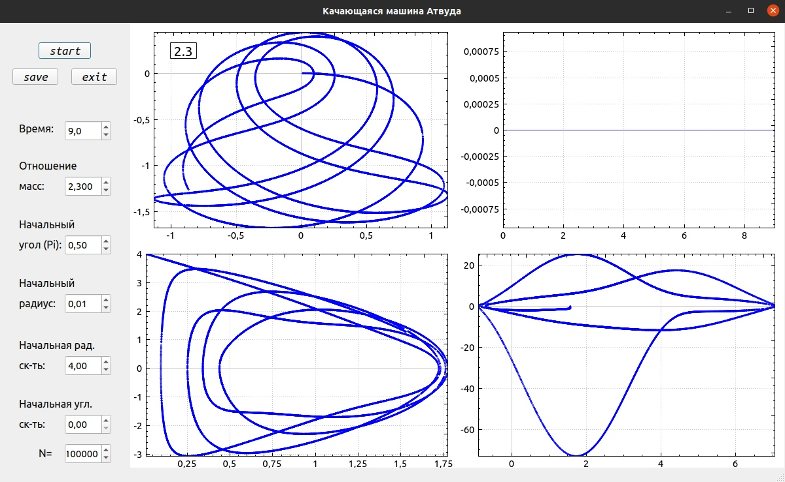
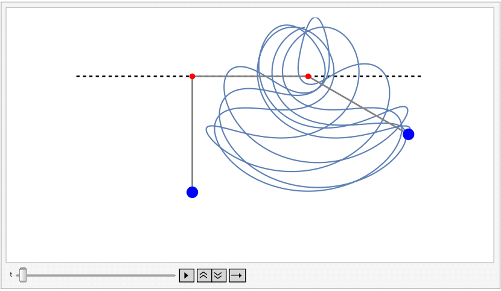

# Swinging Atwood Machine

## Overview

This project numerically solves the system of differential equations describing a swinging Atwood machine using the Runge-Kutta method of the 4th order. The program provides a graphical interface where you can set up the parameters and view the resulting trajectory path:

**Parameters that can be set in the program menu:**
1. Number of steps;
2. Simulation time;
3. Mass ratio of the weights;
4. Initial angle;
5. Initial string length;
6. Initial radial velocity;
7. Initial angular velocity;

**Graphs generated by the program:**
1. Trajectory of the weight (top left);
2. Relative energy change $\epsilon(t)=|100*\frac{E(t)-E(0)}{E(0)}|$ over time $t$ (top right);
3. Phase portrait #1: dependence of $\dot r(t)$ on $r(t)$ (bottom left);
4. Phase portrait #2: dependence of $\dot \theta (t)$ on $\theta (t)$ (bottom right);

## Project Structure
- **cpp_qt_project**: Contains the C++ code for the Qt project.
- **pictures**: Contains the trajectory plots generated from the calculations. The filenames follow the format: `MassRatio_StartingAngle.png`.
- **project_overview_RU.pdf**: A detailed description of the project in PDF format (in Russian).
- **atwood.nb**: Additional code written in Wolfram Mathematica. This code solves the problem using the built-in `NDSolve` method, allowing for result verification and the creation of cool animations like this one:

---

## References

1. B. Tuffilaro, A. Abbot,  and J. Griffits. Atwood’s machine. American Journal of Physics, doi: 10.1119/1.13791, 1984. [Link](https://doi.org/10.1119/1.13791)
2. Л. Д. Ландау и Е. М Лифшиц. Теоретическая физика: Т.I Механика. Издательство Наука. 1988. --- 216 c.
3. Нефедов Н.Н., Попов В.Ю., Волков В.Т. Обыкновенные дифференциальные уравнения. Курс лекций — М.: Физический факультет МГУ им. М.В. Ломоносова, 2016. — 200 с.

